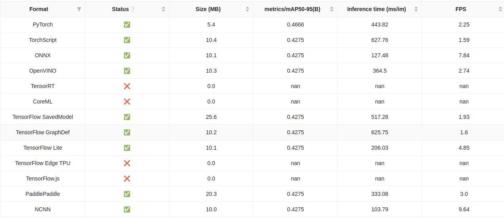

# Smart City - IoT / AI-based people frequency measurement


<a id="readme-top"></a>

<details>
  <summary>Table of Contents</summary>
  <ol>
    <li>
        <a href="#foreword">Foreword</a>
    <li>
      <a href="#about-the-project">About The Project</a>
      <ul>
        <li><a href="#built-with">Built With</a></li>
        <li><a href="#features">Features</a></li>
      </ul>
    </li>
    <li>
    <a href="#environment-variables">Environment Variables</a>
    </li>
    <li>
      <a href="#getting-started">Getting Started</a>
      <ul>
        <li><a href="#installation">Installation</a></li>
        <li><a href="#first-steps">First steps</a></li>
      </ul>
    </li>
  </ol>
</details>

## Built With

- [**Ultralytics**](https://github.com/ultralytics/ultralytics)
- [**React**](https://reactjs.org/)
- [**Flask + Hypercorn**](https://flask.palletsprojects.com/)
- [**Docker**](https://www.docker.com/)
- [**Ant Design**](https://ant.design/)

## About The Project

This application is a prototype for AI-supported object counting in public spaces. The system is based on the **Ultralytics** framework and uses **YOLO11** models for automatic object tracking. The application is highly parameterizable, which enables it to be transferred to different scenarios. The counting logic is based on freely definable regions of interest (ROI). Optionally, the counts can be published via an integrated **MQTT** client, and there is also an **OIDC**-based login mechanism.

A key feature of the application is the flexibility of image capture. In addition to standard cameras via **OpenCV** and the **PiCamera2** for Raspberry Pi, **YouTube** livestreams can also be used as a video source. **CUDA** support has been implemented to accelerate the processing of large amounts of data on compatible GPUs.

The modular, thread-based architecture ensures stable execution even with resource-intensive processes. The containerized solution also enables easy deployment in different environments. The user interface was implemented using **React** and **Ant Design** and is provided via a **Flask** and **Hypercorn** server, which also serves as the backend for the application.

## Features

- **Docker** containerization for scalable deployment
- **OIDC** (tested with Keycloak)
- **Live streams** via **OpenCV**, **Picamera2**, or **YouTube**
- **CUDA support** for GPU-accelerated inference
- **YOLO11** including export and benchmarking
- **Creation of simulation videos** for model comparison
- **Real-time resource utilization**
- **MQTT-based app control**

## Recommended Environment

- Quad Core CPU
- 4 GB RAM (8 GB recommended)
- CUDA-capable GPU
- At least 20 GB of free storage space

**Benchmark on a Raspberry PI 4 (CPU, imgsz 320):**



## Environment Variables

| **Variable**          | **Default**                                         |
| --------------------- | --------------------------------------------------- |
| `ULTRALYTICS_VERSION` | `8.3.8`                                             |
| `APP_DOMAIN`          | `http://0.0.0.0:8080`                               |
| `APP_PORT`            | `8080`                                              |
| `BENCHED`             | `False`                                             |
| `APP_DEV_MODE`        | `False`                                             |
| `ALLOWED_ORIGINS`     | `https://first_origin.com,http://second_origin.com` |
| `SECRET_KEY`          | `secrets.token_urlsafe(16)`                         |
| `ENCRYPTION_KEY`      | `secrets.token_urlsafe(32)`                         |
| `GRAFANA_URL`         | `https://...`                                       |
| `GRAFANA_TOKEN`       | `API_TOKEN`                                         |
| `USE_OIDC`            | `False`                                             |

If **USE_OIDC** is enabled, the following variables must be set:

| **Variable**                   | **Default**                                                     |
| ------------------------------ | --------------------------------------------------------------- |
| `OIDC_CLIENT_ID`               | `<CLIENT_ID>`                                                   |
| `OIDC_CLIENT_SECRET`           | `xxxxxxxxxxxxxxx`                                               |
| `OIDC_HOST`                    | `https://your_keycloak_server.com`                              |
| `OIDC_ISSUER`                  | `/realms/<REALM_NAME>`                                          |
| `OIDC_USERINFO_URI`            | `/realms/<REALM_NAME>/protocol/openid-connect/userinfo`         |
| `OIDC_TOKEN_INTROSPECTION_URI` | `/realms/<REALM_NAME>/protocol/openid-connect/token/introspect` |
| `OIDC_SERVER_METADATA_URL`     | `/realms/<REALM_NAME>/.well-known/openid-configuration`         |
| `OIDC_SCOPES`                  | `openid,email,profile,offline_access`                           |
| `APP_REDIS_SERVER`             | `True`                                                          |
| `REDIS_HOST`                   | `redis`                                                         |
| `REDIS_PORT`                   | `6379`                                                          |

Keycloak settings:

- Valid redirect URIs: .../oidc_callback
- Valid post logout redirect URIs .../signout

## Getting Started

- Ubuntu 22.04
- Python 3.11
- Docker and Compose Plugin

### Installation (Recommended way)

1. Build the Docker image for the application. This can take a while:
   - `docker build -f Dockerfile -t iot-app .`
2. Start the application:
   - `docker compose up iot-app -d`

---

### First steps

1. Run a benchmark test. Ultralytics installs additional packages.
2. (Optionaly) Run a second benchmark test, as this is the only way to properly activate the additional packages at runtime. This will provide more realistic values for the FPS performance.
3. Define ROI and tags.
4. Test different configurations based on simulation videos.
5. Start inference

Up to this point, the application has a standalone character. Optionally, it's worth looking at the [IoTPlattform](https://github.com/OrhanSalman/IoTPlattform). Through this, you can set up a Keycloak user, an MQTT broker, as well as Grafana.

## CUDA in Docker

1. Uncomment the sections in the Compose file
2. Take a look at the these compatibility lists and check your Nvidia and CUDA driver versions with `nvidia-smi`

- TF: https://www.tensorflow.org/install/source#gpu
- CUDA & cuDNN: https://docs.nvidia.com/deeplearning/cudnn/backend/latest/reference/support-matrix.html

3. Additionally follow these steps: https://docs.nvidia.com/datacenter/cloud-native/container-toolkit/latest/install-guide.html#installing-with-apt

```bash
curl -fsSL https://nvidia.github.io/libnvidia-container/gpgkey | sudo gpg --dearmor -o /usr/share/keyrings/nvidia-container-toolkit-keyring.gpg \
    && curl -s -L https://nvidia.github.io/libnvidia-container/stable/deb/nvidia-container-toolkit.list | \
    sed 's#deb https://#deb [signed-by=/usr/share/keyrings/nvidia-container-toolkit-keyring.gpg] https://#g' | \
    sudo tee /etc/apt/sources.list.d/nvidia-container-toolkit.list

sudo sed -i -e '/experimental/ s/^#//g' /etc/apt/sources.list.d/nvidia-container-toolkit.list
sudo apt-get update
sudo apt-get install -y nvidia-container-toolkit
sudo nvidia-ctk runtime configure --runtime=docker
sudo systemctl restart docker
```

---

This is a prototyp. It can include bugs and mistakes. Do not use it in production environments.
